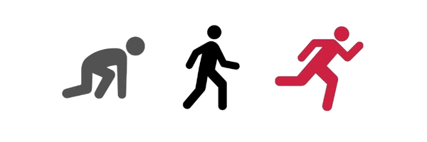

# Week 3: Arrays and Logics

Selamat sudah melalui kegiatan pekan kedua! Pekan ketiga ini kita akan melatih pemahaman tentang logika dan implementasinya ke berbagai kasus. Pastikan kalian telah memahami dengan baik materi di minggu sebelum nya.

Karena sudah menginjak pekan ke 3, ada baiknya kamu menyelesaikan tugasnya dari hari ke hari secara rutin. Semaksimal mungkin tugas-tugas yang ada tidak ditumpuk di kemudian hari atau bahkan di akhir minggu, karena mulai pekan 3 ini setiap hari nya ada challenge coding yang menentukan kelanjutan ke step 2 :bowtie: , dan semua challenge yang bertanda :anchor: ini wajib diselesaikan.

## Senin - Mengenal Tipe Data Array

Sebelumnya, kita telah belajar berbagai macam tipe data yang kita tampung di variabel JavaScript dan kita bermain operasi dengannya, menggunakan conditional, bahkan hingga looping. Sekarang, saatnya kita berkenalan dengan Array, tipe data yang sangat berguna untukmu dalam membuat penampungan data yang terstruktur.

Materi & Referensi :

- :notebook_with_decorative_cover: [Mempelajari tipe data Array](./week-3/learn/js-array.md)

Tugas :

- :anchor:
[[**Exercises 1**] JavaScript Building Blocks: Codecademy JavaScript Course (Unit 4 - Arrays)](https://www.codecademy.com/learn/learn-javascript)
- :anchor:
[[**Exercises 2**] Tantangan Array 1 (Mengakses Nilai dalam Array)](./week-3/challenge/anchor-akses-array.md)
- :anchor:
[[**Exercises 3**] Tantangan Array 2 (Melooping menggunakan Array)](./week-3/challenge/anchor-loop-array.md)
- :anchor:
[[**Exercises 4**] Tantangan Array 3 (Array Join, Split, Slice, Splice, Sort)](./week-3/challenge/anchor-mixed-array.md)

## Selasa - Logic Challenges Refresh

Gunakan waktu sejenak untuk berkenalan dengan Node Js,
sebuah platform yang memungkinkan kamu untuk menjalankan script JavaScript di server. Jadi, kamu bisa dengan mudah membuat kode JavaScript yang dapat berjalan di terminal kamu. Hari ini juga, kamu akan mencoba langsung mengimplementasi kodemu melalui node Js!

Materi & Referensi :
- :notebook_with_decoretive_cover: [Array Multidimensi](./week-3/learn/array-multidimensi.md)
- :notebook_with_decorative_cover:
[Mengenal Node JS](./week-3/learn/js-node.md)

Tugas :
- :anchor:
[[**Exercises 5**] Palindrome](./week-3/challenge/challenge-palindrome.md)
- :anchor:
[[**Exercises 6**] Palindrome Angka](./week-3/challenge/challenge-palindrome-angka.md)
- :anchor:
[[**Exercises 7**] Hitung Jumlah Kata](./week-3/challenge/challenge-hitung-jumlah-kata.md)

## Rabu - More Logic Challenges

Hari baru, tantangan baru. Setelah belajar tentang array and solve berbagai problem dengan arrays, saatnya perbanyak latihan dengan soal yang terus melatih logika!

Tugas :
- :anchor:
[[**Exercises 8**] Pasangan Angka Terbesar](./week-3/challenge/challenge-pasangan-terbesar.md)
- :anchor:
[[**Exercises 9**] Cari Mean](./week-3/challenge/challenge-cari-mean.md)
- :anchor:
[[**Exercises 10**] Perkalian Unik](./week-3/challenge/challenge-perkalian-unik.md)

## Kamis - More Arrays + Multidimensional Array

Kamu telah mencoba berbagai macam soal, menggunakan array maupun tidak. Tentunya di saat ini kamu telah bisa menilai cara mana yang lebih baik menggunakan array, dan yang tidak perlu, bukan?

Hari ini, kamu akan bermain dengan array dan bentuk selanjutnya, yaitu array multidimensi. Tenang saja, array multidimensi konsep nya sama persis dengan array satu dimensi!

- :anchor:
[[**Exercises 11**] Deret Aritmatika](./week-3/challenge/challenge-deret-aritmatika.md)
- :anchor:
[[**Exercises 12**] Target Terdekat](./week-3/challenge/challenge-target-terdekat.md)

## Jumat 

- :anchor:
[[**Exercises 13**] Deret Geometri](./week-3/challenge/challenge-deret-geometri.md)
- :anchor:
[[**Exercises 14**] Mengelompokkan Angka](./week-3/challenge/challenge-kelompok-angka.md)
- :anchor:
[[**Exercises 15**] Mengelompokkan Hewan](./week-3/challenge/challenge-kelompok-hewan.md)

## Sabtu 
[Live Code 1](./ujian/live-code-2.md)

## Minggu

- [Kegiatan Akhir Pekan](./week-3/learn/kegiatan-akhir-pekan-3.md)

Jika ada hal yang perlu ditanyakan, langsung saja berdiskusi di grup ya.

Salam,

Tim Aa Academy
