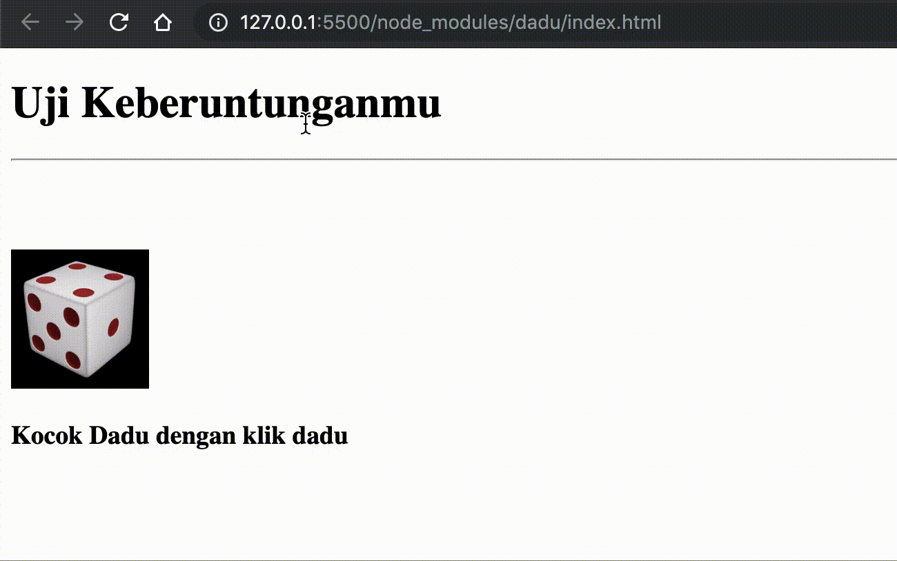

# Game Lucky Dadu

## Objective

- Dapat menerapkan selector DOM
- Bisa Membuat Element
- Menambahkan Atribute
- Menggunakan Event DOM

## Directions
Buatlah aplikasi game lucky dadu, dimana kamu akan mengocok dadu, jika dadu yang kamu kocok dengan dadu yang disembunyikan oleh komputer sama maka tampilkan benar, jika tidak tampilkan salah.

> N/B: Manpaatkan `Math.random()`, `if-elseif`, dll

Perhatikan demo berikut




Kamu bisa memakai gambar berikut:

- Tanya


- Versus


## Soal
Buatlah file `index.html`, dan lakukan koding! 

```html
<!DOCTYPE html>
<html lang="en">
<head>
    <meta charset="UTF-8">
    <meta name="viewport" content="width=device-width, initial-scale=1.0">
    <meta http-equiv="X-UA-Compatible" content="ie=edge">
    <title>Lucky Dadu</title>
    <style>
        /* tulis style disini*/
    </style>
</head>
<body>
    <!--html kode disini -->

    <script>
        // Tulis Kode javascript disini
    </script>
</body>
</html>
```