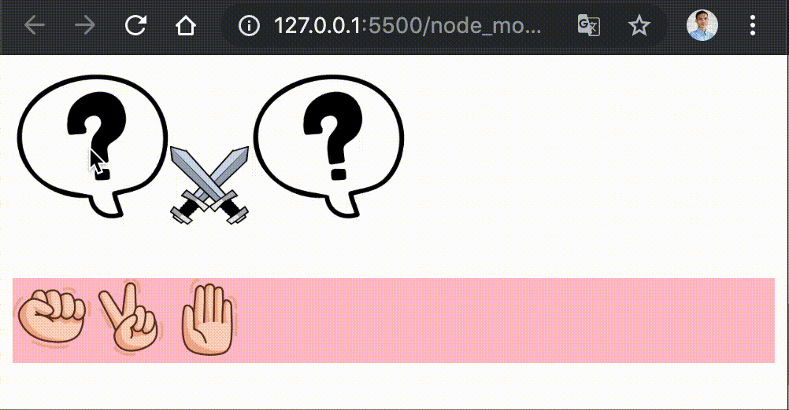

# Game Suit

## Objective

- Dapat menerapkan selector DOM
- Bisa Membuat Element
- Menambahkan Atribute

## Directions
Buatlah aplikasi game suit antara kamu dan komputer, Permainan ini sebenarnya berasal dari negeri yang di sebut negeri matahari atau yang kita kenal sebagai Negara JEPANG, Permaian ini hanya bisa di mainkan oleh dua orang. Pemain menggunakan tangan mereka sendiri untuk menentukan apakah dia akan membentuk “Gunting,Batu atau Kertas”.

> N/B: Manpaatkan `Math.random()`, `array`, `if-elseif`, dll

**Peratutan Game**

Permaianan ini akan terdiri dari 3(tiga) buah babak, dimana di setiap babak pemain akan mendapatkan nilai bila pemain memenangkan setiap babaknya
Pemain hanya boleh mebentuk “Gunting,Batu atau Kertas” yang akan di keluarkan untuk melawan musuhnya.

Peraturan kemenangan :
- Gunting bisa di kalahkan dengan batu
- Batu bisa di kalahkan oleh kertas
- Kertas bisa di kalahkan dengan gunting

Perhatikan demo berikut




Kamu bisa memakai gambar berikut:

- Tanya


- Versus


- Gunting


- Batu


- Kertas


## Soal
Buatlah file `index.html`, dan lakukan koding! 

```html
<!DOCTYPE html>
<html lang="en">
<head>
    <meta charset="UTF-8">
    <meta name="viewport" content="width=device-width, initial-scale=1.0">
    <meta http-equiv="X-UA-Compatible" content="ie=edge">
    <title>Suit</title>
    <style>
        /* tulis style disini*/
    </style>
</head>
<body>
    <div id="app">
    </div>

    <script>
        var app = document.getElementById('app')
        var suit = ['batu.png', 'gunting.png', 'kertas.png']

        // Tulis Kode javascript disini
    </script>
</body>
</html>
```